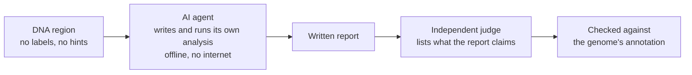
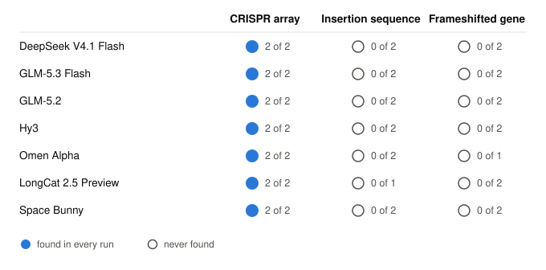
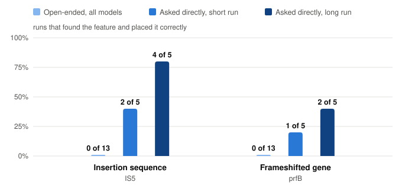

# Can an AI agent notice what is hidden in DNA?

In 2026 Anthropic reported that AI agents, left to explore genomes on their own,
found an enzyme system nobody had described. I wanted to understand what makes
that kind of discovery possible, so I built a small testbed: hand an agent a
stretch of DNA with no labels, let it investigate, and check what it finds
against what biologists already know is there.

**309 agent runs, seven language models, one consistent pattern: the agents know
more than they volunteer.**

## How it works

The agent works in a sealed environment, so a correct answer comes from reasoning
about the sequence and not from looking it up. Every step it takes is recorded.

## What I found

### Every model finds the obvious feature, and every model misses the subtle ones

Seven models were given the same *E. coli* regions and asked to report anything
notable. All of them found the CRISPR array. None found the insertion sequence
or the frameshifted gene, whatever the model's size, price or thinking budget.

<picture>
  <source media="(prefers-color-scheme: dark)" srcset="docs/figures/models-dark.svg">
  
</picture>

### The knowledge is there. Nobody asked for it.

The misses were not blind spots. Reading the reports, the agents often had the
evidence in hand (the gene inside the insertion sequence, the tell-tale repeats
at its ends) and moved on without drawing the conclusion.

So I asked directly: *does this region contain an insertion sequence?* The same
model that never mentioned one in open exploration now found it in four runs out
of five, three times with boundaries matching the annotation to within a base.
Across 15 runs on regions without one, it never claimed to see it.

<picture>
  <source media="(prefers-color-scheme: dark)" srcset="docs/figures/asked-dark.svg">
  
</picture>

The frameshifted gene tells the cautionary half of the story: asked directly, the
model found it twice, but it also said "yes" in the wrong place. A leading
question can surface real knowledge and invite confident mistakes.

## What worked well

- **Reliable where it should be.** On planted repeat arrays the agent was right in
  30 of 30 runs with no false alarms, and all seven models found the real CRISPR
  array every time.
- **A fair test.** The sealed environment was added after one model was caught
  quietly using an online database. Results from before and after that fix are
  kept apart.
- **Everything is inspectable.** Each run keeps its full transcript, so any
  number here can be traced back to what the agent actually did.

These are early results on a handful of regions from one genome. The pattern is
consistent; the sample is small.

## Where this goes next

1. **A supervisor that asks the right question.** If the gap is initiative, a
   second model reviewing the report might close it without being told the answer.
2. **Better instruments.** Give the agent specialised tools, such as DNA language
   models, and see whether it uses them to test its own ideas.
3. **Regions with no known answer.** The real goal is discovery, which means
   judging findings nobody has annotated yet.

## Explore the results

| What | Where |
|---|---|
| Planted repeat arrays in synthetic DNA (60 runs) | [`results/synthetic/`](results/synthetic) |
| Twelve *E. coli* regions, two models (144 runs) | [`results/ecoli/`](results/ecoli) · [comparison](results/ecoli/comparison.md) · [report analysis](results/ecoli/exploration.md) |
| Seven models in the sealed environment (55 runs) | [`results/sandbox_pilot/`](results/sandbox_pilot) |
| Direct questions (50 runs) | [`results/direct_questions/`](results/direct_questions) |

Code is in [`src/`](src), test regions in [`data/`](data), run logs in [`logs/`](logs).

[Reproduce the experiments](docs/reproduction.md) ·
[How the sealed environment works](docs/isolation.md) ·
[Plans in detail](docs/future_tests.md)

---

Inspired by Yoon et al., *Autonomous AI agents discover reverse transcriptases
with tandem repeat arrays* (Anthropic, 2026).
