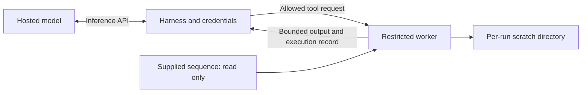

# Controlled execution environment

All three agent tools now run in a restricted Linux worker. The model API
client stays in the parent process and connects to the inference provider;
model-written code cannot use that connection, its credentials or host files.
The historical pilot used the earlier unrestricted runner. Its results remain
in their original directories; no isolated model batch has been run yet.



## What the agent can access

| Capability | Default policy |
|---|---|
| Tools | `list_files`, `read_file`, `run_python` |
| Input contents | Only `region.fasta`, read only |
| Generated files | Read/write under `scratch/` only |
| Python | System Python with its standard library; no project virtual environment |
| Packages and external programs | No NumPy, Biopython, pip, BLAST, shell, or subprocess execution |
| Network | Socket syscalls denied, including TCP, UDP, localhost and Unix sockets |
| Host contents | Denied except the Python runtime, required shared libraries, `/dev/null` and `/dev/urandom` |
| Credentials and inherited handles | Cleared environment; parent descriptors closed |
| State | Fresh interpreter per call; scratch persists within a run and is removed at its end |

Agents can implement their own algorithms using the standard library. The
policy controls available tools, readable inputs and execution limits. It
does not provide a package-installation or network opt-out.

## Configure and check

Edit or copy [`sandbox_policy.json`](../src/sandbox_policy.json). `allowed_tools`
can be narrowed to any nonempty subset of the three supported tools.
`input_files` names permitted files relative to the worker root; the DNA
harness supplies `region.fasta` and requires it in this list. The worker never
receives answer keys or repository files as inputs.

```bash
.venv/bin/python src/isolation.py                         # eight offline probes
.venv/bin/python tests/test_isolation.py              # kernel and harness checks
.venv/bin/python tests/test_offline.py                # existing pipeline checks
.venv/bin/python src/harness.py --sandbox-policy sandbox_policy.json \
  --loci data/ecoli/loci --out results/isolated/example --reps 1 --dry-run
```

These checks make no model API calls. `--dry-run` lists jobs and validates the
configuration; the self-test checks actual kernel enforcement. Remove
`--dry-run` and choose the provider/model when ready for a paid batch.

Default limits are 30 seconds wall time, 25 seconds CPU time, 512 MiB virtual
address space, 8 MiB per generated file, and 64 open descriptors per call.
CPU has a hard stop one second above its soft limit. Scripts are capped at
128 KiB; stdout and stderr are each capped at 20,000 bytes. Scratch is monitored
against 32 MiB and 256 entries across the run. Exceeding an output, wall-time or
scratch limit stops execution and marks the tool result as an error.

## Enforcement and records

[`isolation.py`](../src/isolation.py) starts system Python with `-I -S`, a clean
environment and closed inherited descriptors. The trusted
[`sandbox_worker.py`](../src/sandbox_worker.py) applies resource limits,
Landlock filesystem restrictions and a seccomp syscall allowlist before it
executes any model-written code. Sockets, process/thread creation, execution of
another program and privilege changes have no allowed syscall rule. These are
kernel restrictions, so changing Python globals or calling libc does not
remove them. See the [Landlock documentation](https://docs.kernel.org/userspace-api/landlock.html)
and [seccomp reference](https://man7.org/linux/man-pages/man2/seccomp.2.html).

Runtime file rules exclude `site-packages`, `dist-packages` and bundled pip
under `ensurepip`, even when these sit inside the standard-library directory.
The scratch monitor opens directories without following symlinks, including
when an entry changes during the scan.

Requirements are Linux on x86-64 or AArch64, Landlock ABI 6 or later,
`libseccomp`, system Python and `ldd` for trusted runtime discovery. The
harness verifies activation before constructing its API client and again
before every run. A dedicated pipe reports setup success and is closed before
agent code starts. Setup failure stops execution; there is no unrestricted
fallback.

Each run records the policy and its hash, Python version and binary hash,
Landlock ABI and verified setup. Tool calls record stdout, stderr, exit status,
signals, timing, output counts, truncation and limit failures. The offered tool
list matches the policy in both provider adapters. Resume rejects directories
containing historical unrestricted runs or a different execution policy/code.
Use a fresh output directory when changing the experiment.

## Boundary

This host refuses container namespace creation, so this runner uses Landlock
and seccomp without a mount or PID namespace. It controls file contents and
writes, but **basic host metadata such as path existence and `stat` remains
visible**. Workers share the host kernel; this is not a virtual machine.
Scratch totals are checked by the parent, rather than enforced by a hard
filesystem quota, so brief overshoot is possible. Isolation blocks live lookup
through agent tools; it does not establish whether a model memorised a sequence
during training.
